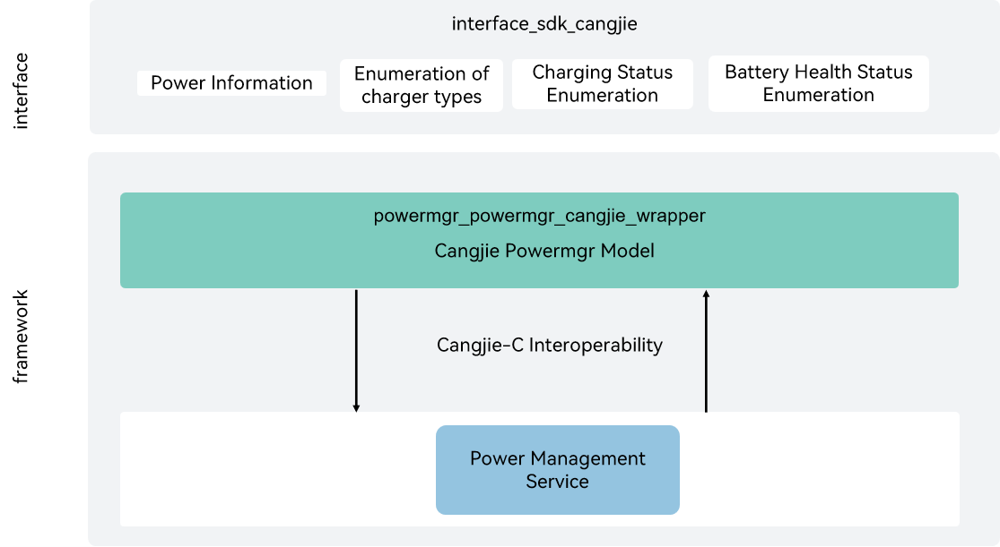

# powermgr_cangjie_wrapper

## Introduction

The powermgr_cangjie_wrapper is a Cangjie API encapsulated on OpenHarmony based on the capabilities of the power management subsystem. 

## System Architecture

**Figure  1** powermgr_cangjie_wrapper architectur



## Directory Structure

```
base/powermgr/powermgr_cangjie_wrapper
├── ohos             # Cangjie Power Management code
├── figures          # architecture pictures
```

## Constraints

The currently open position service Cangjie interface supports only standard devices.

## Usage

The following power service functions are provided:

- Battery Service: Supports charging and discharging, and displays information on battery and charging status.

Compared to Arkts, the following functions are currently not supported:

- System restarting: restarts or shuts down the system.
- System power management: manages the system power status and running lock.
- Display-related power consumption adjustment: adjusts the backlight brightness based on the ambient light and turns off the screen based on the proximity light.
- Power Saving Mode: Provides a low-power operating mode without compromising essential functions and performance.
- Battery Service: Battery status detection, including status updates and reporting, as well as charging during shutdown.
- Temperature Control: Manages applications, SoC, and peripherals when the device temperature reaches a certain level to limit the rise in temperature.
- Power consumption statistics: collects statistics on the power consumption of software, hardware, and a single application.
- Battery service for mini-, small-, and standard-system devices
- Power management service for mini-, small-, and standard-system devices

For APIs related to location, please refer to [ohos.battery_info](https://gitcode.com/openharmony-sig/arkcompiler_cangjie_ark_interop/blob/master/doc/API_Reference/source_en/apis/BasicServicesKit/cj-apis-battery_info.md).

## Repositories Involved

**Power Management Subsystem**

[powermgr_power_manager](https://gitee.com/openharmony/powermgr_power_manager/blob/master/README_zh.md)

## Code Contribution

Developers are welcome to contribute code, documentation, etc. For specific contribution processes and methods, please refer to [Code Contribution](https://gitcode.com/openharmony/docs/blob/master/en/contribute/code-contribution.md).
