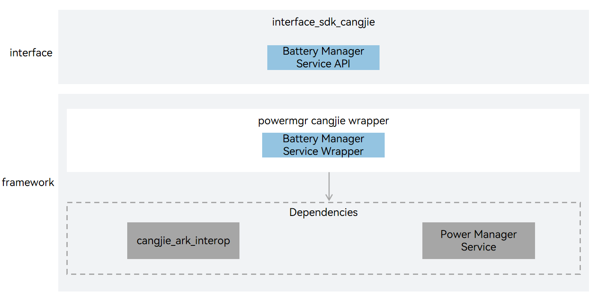

# powermgr_cangjie_wrapper(beta feature)

## Introduction

The powermgr_cangjie_wrapper is a Cangjie API encapsulated on OpenHarmony for application developers to provide battery status and charge-discharge status query capabilities. The currently open power service Cangjie interface only supports standard devices.

**Figure 1** powermgr_cangjie_wrapper architecture



As shown in the architecture diagram:

Interface layer description:

- Battery Service API: Cangjie public interfaces based on battery service encapsulation exposed to developers.

Framework layer description:

- Battery Service Wrapper: Provides battery level information query, charger type enumeration, battery status enumeration, and additional information query enumeration methods. This encapsulation layer is a Cangjie encapsulation implementation of battery service functionality based on the power management service.

Cangjie Power Service Dependencies:

- Power Management Service: Calls the underlying power driver to provide native basic power management service functionality implementation.
- Cangjie Interop: Encapsulates public interfaces for C language interoperation, and provides Cangjie tag class implementation for annotating Cangjie APIs, as well as providing BusinessException exception class definitions thrown to users.

## Directory Structure

```
base/powermgr/powermgr_cangjie_wrapper
├── figures                           # architecture pictures
├── ohos                              # Cangjie Power Management code
│   └── battery_info                  # Cangjie battery_info code
├── test                              # Test cases
│   └── battery_info                  # Battery service tests
└── bundle.json                       # Component description file
```

## Usage

The following power service functions are provided:
- Battery Service: Supports charging and discharging, and displays information on battery and charging status

Power service usage examples please refer to [Battery Information Development Guide](https://gitcode.com/openharmony-sig/arkcompiler_cangjie_ark_interop/blob/master/doc/Dev_Guide/source_en/basic-services/cj-battery-info-development-guide.md).

## Constraints

Compared with the API capabilities provided by ArkTS, the following functions are currently not supported:
- Restart Service: System restart and power off
- System Power Management Service: System power status management and sleep running lock management
- Display-related energy consumption adjustment: Including adjusting backlight brightness according to ambient light, and turning the screen on and off according to proximity light
- Power saving mode: Provides a low-power operation mode without damaging main functions and performance
- Battery service: Battery status detection, including status updates and reporting, as well as shutdown charging
- Temperature control: After the device temperature reaches a certain level, manage applications, SoC, and peripherals to limit temperature rise
- Power consumption statistics: Mainly includes software power consumption and hardware power consumption statistics, as well as power consumption statistics for individual applications
- Battery service for lightweight devices
- Power management service for lightweight devices

## Code Contribution

Developers are welcome to contribute code, documentation, etc. For specific contribution processes and methods, please refer to [Code Contribution](https://gitcode.com/openharmony/docs/blob/master/en/contribute/code-contribution.md).

## Repositories Involved

[powermgr_power_manager](https://gitcode.com/openharmony/powermgr_power_manager/blob/master/README.md)

[arkcompiler_cangjie_ark_interop](https://gitcode.com/openharmony-sig/arkcompiler_cangjie_ark_interop/blob/master/README.md)