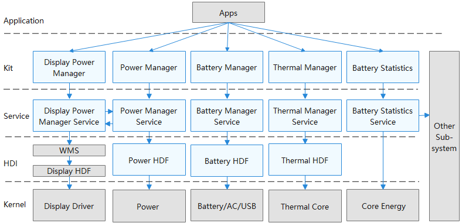

# 电源管理子系统

## 简介

电源管理子系统提供如下功能：

1.  重启服务：系统重启和下电。
2.  系统电源管理服务：系统电源状态管理和休眠运行锁管理。
3.  显示相关的能耗调节：包括根据环境光调节背光亮度，和根据接近光亮灭屏。
4.  省电模式 ：在不损害主要功能和性能的前提下，提供一种低功耗操作模式 。
5.  电池服务：支持充放电、电池和充电状态的监测，包括状态的更新和上报，还包括关机充电。
6.  温控 ：在设备温度到一定程度之后对应用、SoC、外设进行管控，限制温升 。
7.  耗电统计： 主要包括软件耗电和硬件耗电统计，以及单个应用的耗电统计 。
8.  轻设备电池服务。
9.  轻设备电源管理服务。

**图 1**  电源管理子系统架构图




## 目录

```
base/powermgr/powermgr_cangjie_wrapper
├── ohos                # 仓颉电源管理接口实现
├── figures             # 存放readme中的架构图
```

## 使用说明

如架构图示意，电源管理提供了七个子部件，其中部分部件提供了对外接口或者公共事件通知，开发者可以根据场景使用：

- 通过Power Manager提供的接口可以进行申请和释放休眠运行锁RunningLock、省电模式、亮度调节、重启设备、关机等操作，同时也可以通过公共事件来监听省电模式和关机状态的变化。
- Battery Manager提供了电池信息查询的接口，同时开发者也可以通过公共事件监听电池状态和充放电状态的变化。
- Thermal Manager提供的设备温升状态的查询接口，同时开发者也可以通过注册回调和公共事件来监听设备温升状态。
- Battery Statistics 提供了软硬件耗电统计的功能，可以查询硬件耗电或者应用耗电情况。

## 相关仓

**电源管理子系统**

powermgr_cangjie_wrapper

[powermgr_power_manager](https://gitee.com/openharmony/powermgr_power_manager)
