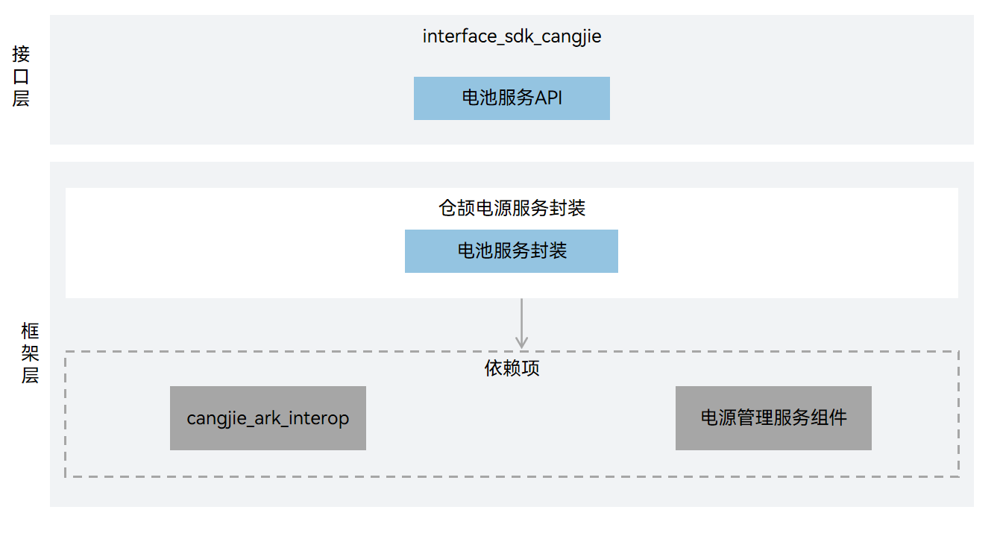

# 电源服务仓颉接口

## 简介

电源服务仓颉接口是在 OpenHarmony 上基于电源管理子系统能力之上封装的仓颉API。

## 系统架构

**图 1**  电源管理仓颉架构图



## 目录

```
base/powermgr/powermgr_cangjie_wrapper
├── ohos                # 仓颉电源管理接口实现
├── figures             # 存放readme中的架构图
```

## 约束

当前开放的电源服务仓颉接口仅支持standard设备。

## 使用说明

提供了以下电源服务功能：

- 电池服务：支持充放电、电池和充电状态的信息显示。

与arkts相比，暂不支持以下功能：

- 重启服务：系统重启和下电。
- 系统电源管理服务：系统电源状态管理和休眠运行锁管理。
- 显示相关的能耗调节：包括根据环境光调节背光亮度，和根据接近光亮灭屏。
- 省电模式 ：在不损害主要功能和性能的前提下，提供一种低功耗操作模式 。
- 电池服务：电池状态检测，包括状态的更新和上报，还包括关机充电。
- 温控 ：在设备温度到一定程度之后对应用、SoC、外设进行管控，限制温升 。
- 耗电统计： 主要包括软件耗电和硬件耗电统计，以及单个应用的耗电统计 。
- 轻设备电池服务。
- 轻设备电源管理服务。

电源服务相关API请参见[ohos.battery_info](https://gitcode.com/openharmony-sig/arkcompiler_cangjie_ark_interop/blob/master/doc/API_Reference/source_zh_cn/apis/BasicServicesKit/cj-apis-battery_info.md)。

## 相关仓

[powermgr_power_manager](https://gitee.com/openharmony/powermgr_power_manager/blob/master/README_zh.md)

## 参与贡献

欢迎广大开发者贡献代码、文档等，具体的贡献流程和方式请参见[参与贡献](https://gitcode.com/openharmony/docs/blob/master/zh-cn/contribute/%E5%8F%82%E4%B8%8E%E8%B4%A1%E7%8C%AE.md)。
